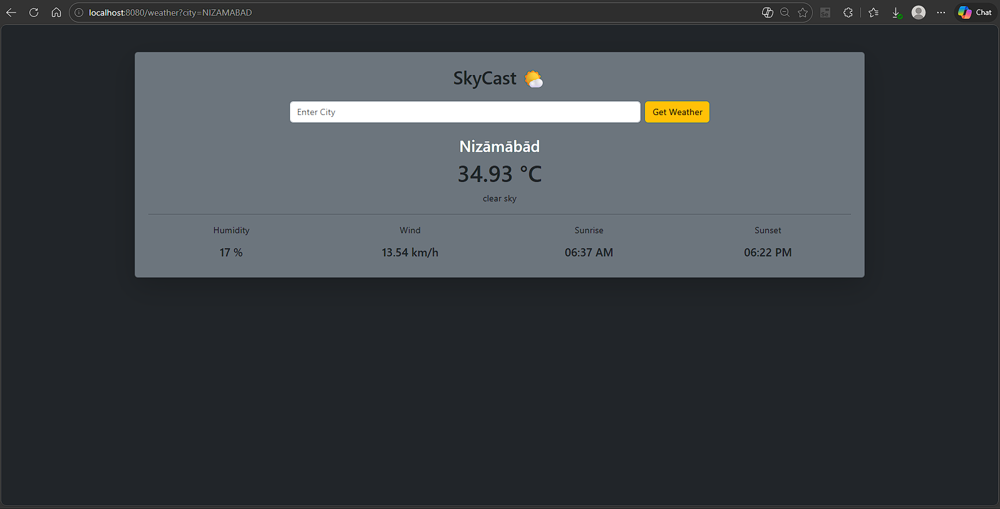

🌤 SkyCast - Weather forecast

SkyCast is a Spring Boot based weather forecasting web application that fetches real-time weather data using the OpenWeather API and displays it in a clean and responsive UI.

📌 Features

- 🌍 Search weather by city name
- 🌡 Real-time temperature (°C)
- 💧 Humidity percentage
- 🌬 Wind speed (km/h)
- 🌅 Sunrise & Sunset time (formatted)
- ☁ Weather description
- 🔐 Secure API key configuration using environment variables
- 🎨 Clean responsive UI with Bootstrap

🛠 Tech Stack

  Backend
- Java 17+
- Spring Boot
- Spring Web
- Thymeleaf
- Jackson (JSON Parsing)
- Maven

  Frontend
- HTML5
- Bootstrap 5
- Thymeleaf Template Engine

  API
- OpenWeatherMap API

🛠 Tech Stack

  Backend
- Java 17+
- Spring Boot
- Spring Web
- Thymeleaf
- Jackson (JSON Parsing)
- Maven

  Frontend
- HTML5
- Bootstrap 5
- Thymeleaf Template Engine

  API
- OpenWeatherMap API

